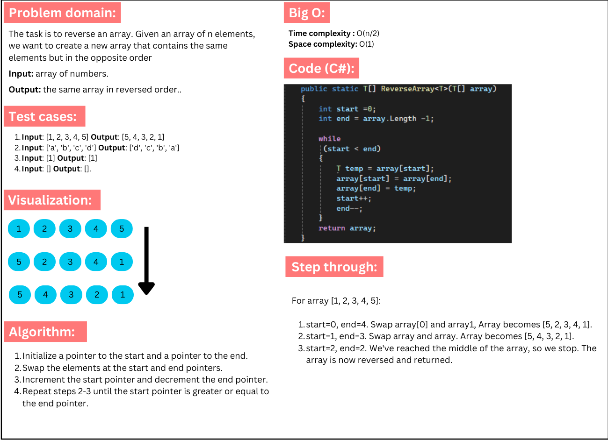

# Challenge 1 A: Array Reversal

### The ReverseArray method takes a string array as input and returns a new array with the elements in reverse order by iterating through the input array from end to start and assigning values to a new array. It then returns this reversed array.

## Whiteboard image:
