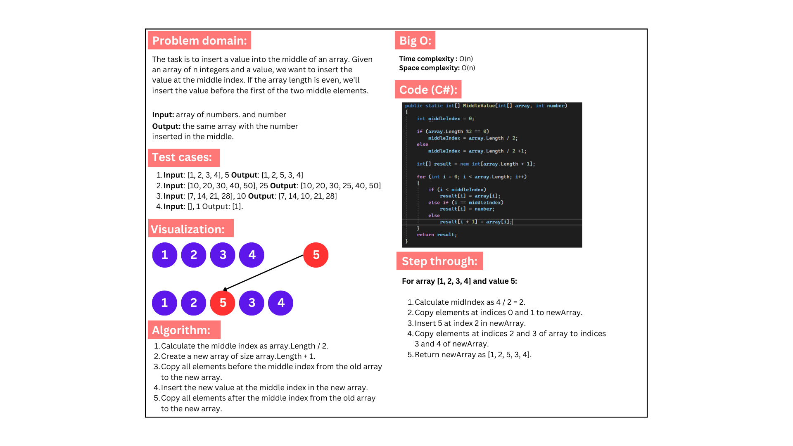

# Challenge 4 : Middle Value

### The MiddleValue method takes an array and an interger to be inserted, returns the array with the interge inserted in the middle of the array.

## Whiteboard image:

