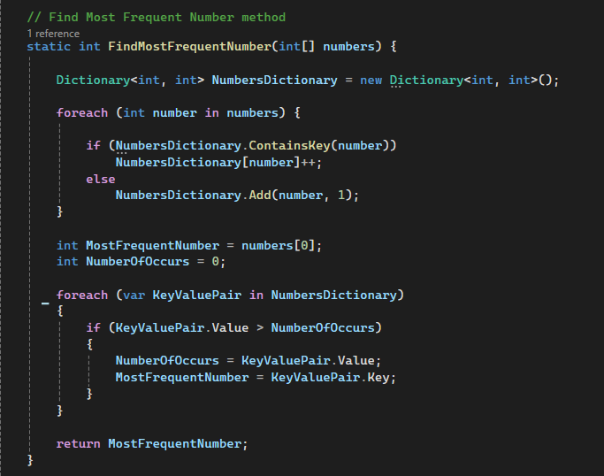

# Challenge 1 B: Most Frequent Number

### The FindMostFrequentNumber method takes an integer array, counts the frequency of each number using a dictionary, and returns the number that occurs most frequently. If multiple numbers have the same highest frequency, the first one encountered is returned.

## Whiteboard image:

