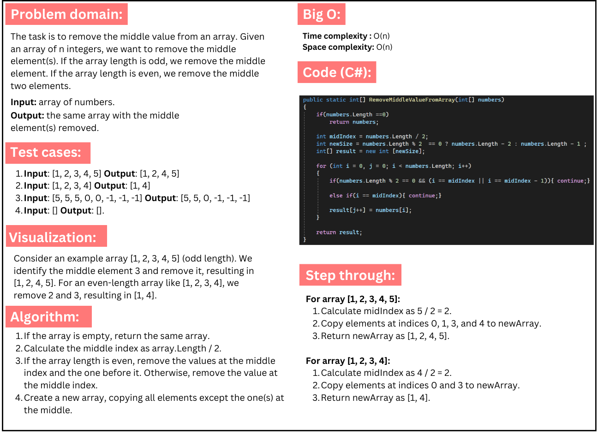

# Challenge 3: Remove Middle Value from Array

### Given an array of n integers, the method remove the middle element(s). If the array length is odd, it removes the middle element. If the array length is even, it removes the middle two elements, and returns the updated array.

## Whiteboard image:
  
